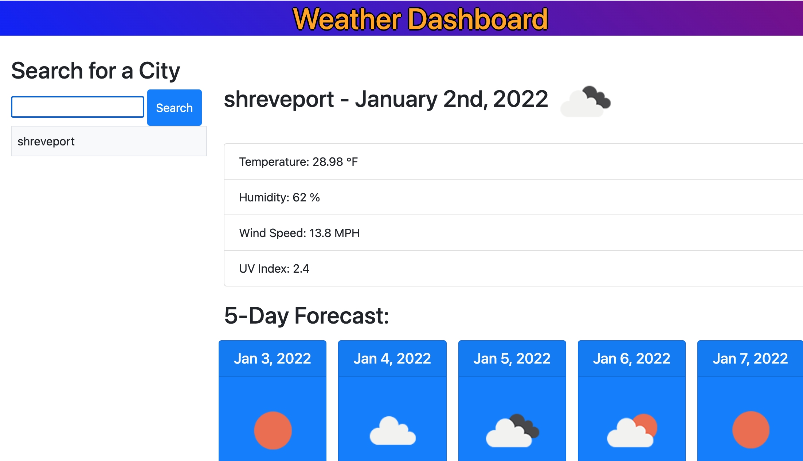

# weather-dashboard
Weather Dashboard
Purpose:
This web application will present an interactive weather dashboard to the user in which he or she can search a city, see current and future weather conditions and click on previously searched city from a historical search list to see the current weather conditions for that city.

Technology used:
Server API: OpenWeatherOne Call API: https://openweathermap.org/api/one-call-api
HTML
CSS
JavaScript
Bootstrap grid layout
jQuery
git and Github

Github repo:
https://github.com/funnygeeky/weather-dashboard.git

URL:
 https://funnygeeky.github.io/weather-dashboard/

 

